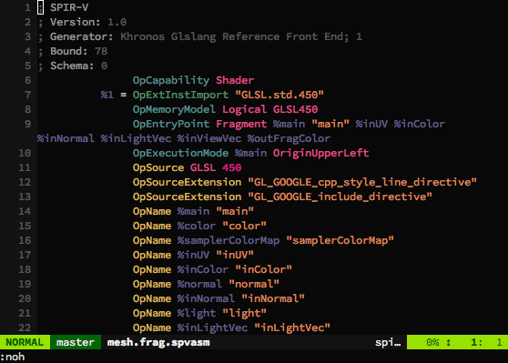

# vim-spirv

A vim plugin for the [Khronos Group][1]'s [SPIR-V][2] standard providing rich
syntax highlighting for disassembled [SPIR-V][2] code (`.spvasm` files) with
interactive visualisation of the ID under the cursor to show, at a glance, the
source of opcode operands.

<div style="text-align: center">
  
</div>

>   This plugin **does not** target the older [LLVM IR][3] based [SPIR 1.2][4]
>   and [2.0][4] specifications.

## Install

Using [vim-plug][5].

```vim
Plug 'kbenzie/vim-spirv'
```

Using [Vundle][6].

```vim
Plugin 'kbenzie/vim-spirv'
```

Using [vim-pathogen][7].

```
git clone https://github.com/kbenzie/vim-spirv.git ~/.vim/bundle/vim-spirv
```

## Options

### `g:spirv_enable_current_id`

Enable automatic highlighting of all occurrences of the ID under the cursor.
This is useful for highlighting where an opcode ID is defined and used at a
glance. See `g:spirv_current_id_highlight`. To disable this option.

```vim
let g:spirv_enable_current_id = 0
```

### `g:spirv_current_id_highlight`

Specify the value of the `SpirvCurrentID` highlight group, this is only set when
the `g:spirv_enable_current_id` option is enabled. To customize this option to
make the current ID bold.

```vim
let g:spirv_current_id_highlight = 'term=bold cterm=bold gui=bold'
```

### `g:spirv_enable_extinst_error`

Enable highlighting extended instruction error highlighting, enabling this
option will parse the file looking for an `OpExtInstImport` instruction,
determine the imported instruction set and set the value of that instruction
sets highlight group, E.G. `SpirvGlslStd450`, to linked to the
`SpirvInstruction` highlight group. If no `OpExtInstImport` instruction is
found, or it is commented out, the extended instruction set highlight group
will be linked to `SpirvError`. When this option is disabled the extended
instruction set highlight group is set to `SpirvInstruction`. To disable this
option.

```vim
let g:spirv_enable_extinst_error = 0
```

# License (MIT)

See [license](LICENSE.md) file.

[1]: https://www.khronos.org/
[2]: https://www.khronos.org/registry/spir-v/
[3]: http://llvm.org/docs/LangRef.html
[4]: https://www.khronos.org/registry/spir/
[5]: https://github.com/junegunn/vim-plug
[6]: https://github.com/VundleVim/Vundle.vim
[7]: https://github.com/tpope/vim-pathogen
